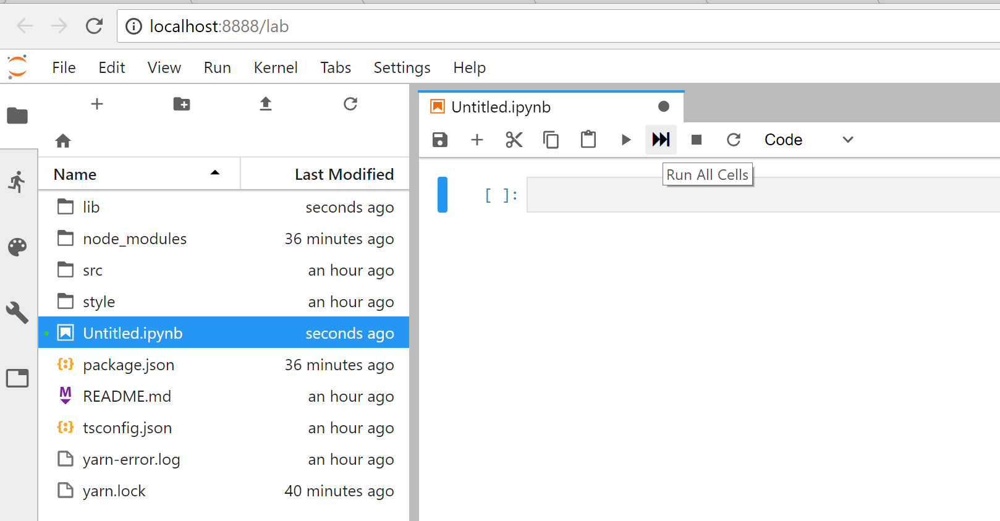
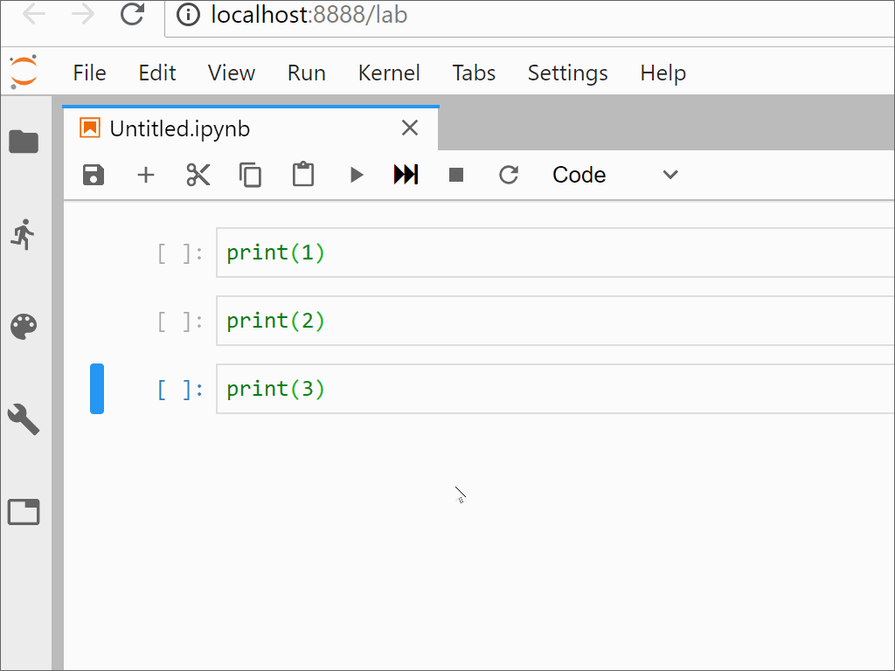
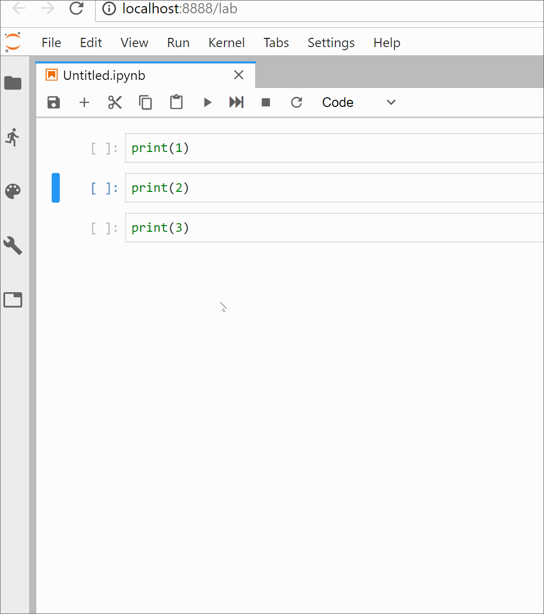

# JupyterLab Run-All Tutorial

This tutorial will teach you how to create a
[document widget extension](https://jupyterlab.readthedocs.io/en/stable/developer/documents.html)
for JupyterLab. These extensions are the lower-level JupyterLab extensions which allow
you to extend the functionality of the document widgets added to the application.

In particular, in this tutorial you will learn how to:
1. Add a toolbar button to the notebook which will run all cells
2. Add a context menu item to the notebook which will run all cells


### Assumptions

This tutorial assumes you have [conda](https://conda.io/miniconda.html) installed on your
machine and available at the command line. 


### 0. Setup a development environment

Set up a new conda environment which includes:
1. The latest version of [JupyterLab](https://github.com/jupyterlab/jupyterlab)
2. [cookiecutter](https://github.com/audreyr/cookiecutter), the tool used to bootstrap the extension
3. [NodeJS](https://nodejs.org/en/), the JavaScript runtime used to compile the extension
4. [git](https://git-scm.com/), the version control system used throughout this tutorial

Creating a new conda environment for the extension leaves the root conda environment
untouched. This is a best practice which isolates your extension from other development
activities on your machine.

A new conda environment can be created with the required dependencies by running:
```bash
conda create -n runall-extension jupyterlab cookiecutter nodejs git -c conda-forge
```

Activate the new conda environment so that all commands operate on that environment.

On Unix/Linux:
```bash
source activate runall-extension
```

On Windows:
```cmd
activate runall-extension
```

**Note:** The above command will need to be executed in each new terminal you open in
order to work with the tools installed in that environment.

### 1. Initialize the project

Initialize the project using the JupyterLab extension cookiecutter template:
```bash
cookiecutter https://github.com/jupyterlab/extension-cookiecutter-ts
```

When prompted, enter values like the following:

```bash
author_name []: Your Name
extension_name [myextension]: runall-extension
project_short_description [A JupyterLab extension.]: Add a run-all-cells button to the notebook toolbar
repository [https://github.com/my_name/myextension]: https://github.com/my_name/runall-extension
```

Now cd into the new extension directory and add everything to version control:
```
cd runall-extension
git init
git add .
git commit -m "Initial commit from cookiecutter"
```

### 2. Build and install the extension

Your new extension project has enough code in it to see it working in JupyterLab.
But first, the initial project dependencies must be installed and the extension
code compiled:

```bash
jlpm install
jlpm run build
jupyter labextension install .
```

**Note:** `jlpm` is a command which is included with JupyterLab. It is simply an alias
to a fixed version of [yarn](https://yarnpkg.com/en/). This indirection ensures that all
third party extensions are built with the same package manager as the JupyterLab core.

### 3. Create a notebook toolbar button

Open the `runall-extension/src/index.ts` file. This is where you'll
define the logic for your extension. The cookiecutter template provides
the bare minimum scaffolding for the extension.

In order to add a toolbar button to the notebook, you need to define a
class which implements the `DocumentRegistry.IWidgetExtension` interface.

First, add the following dependencies:
```bash
jlpm add @phosphor/disposable @jupyterlab/apputils @jupyterlab/docregistry @jupyterlab/notebook
```

Next, add these imports to the top of your `index.ts` file:
```typescript
import {
  IDisposable
} from '@phosphor/disposable';

import {
  ToolbarButton
} from '@jupyterlab/apputils';

import {
  DocumentRegistry
} from '@jupyterlab/docregistry';

import {
  NotebookPanel, INotebookModel
} from '@jupyterlab/notebook';
```

Next, create the widget extension class which creates a toolbar button. 
At this point, the button `onClick` callback simply logs to the console:

```typescript
class RunAllCellsButtonExtension implements DocumentRegistry.IWidgetExtension<NotebookPanel, INotebookModel> {

  createNew(panel: NotebookPanel, context: DocumentRegistry.IContext<INotebookModel>): IDisposable {
    // Create the on-click callback for the toolbar button.
    let runAllCells = () => {
      console.log('Run all cells clicked.');
    };
    
    // Create the toolbar button 
    let button = new ToolbarButton({
      className: 'runAllCellsButton',
      iconClassName: 'fa fa-fast-forward',
      onClick: runAllCells,
      tooltip: 'Run All Cells'
    });
    
    // Add the toolbar button to the notebook
    panel.toolbar.insertItem(6, 'runAllCells', button);
    
    // The ToolbarButton class implements `IDisposable`, so the
    // button *is* the extension for the purposes of this method.
    return button;
  }
}
```

Finally, update the extension's `activate` function to register the widget extension:

```typescript
function activate(app: JupyterLab): void {
  let buttonExtension = new RunAllCellsButtonExtension();
  app.docRegistry.addWidgetExtension('Notebook', buttonExtension);
}


const extension: JupyterLabPlugin<void> = {
  id: 'runall-extension',
  autoStart: true,
  activate
};


export default extension;
```

### 4. Try out the extension

At this point, the extension should create a working notebook toolbar button, albeit one that only 
logs a message to the console.

Build the extension:

```bash
jlpm run build
```

Rebuild the JupyterLab application:

```bash
jupyter lab build
```

Launch JupyterLab:
```
jupyter lab
```

Refresh the page and ensure the toolbar button shows up as expected:



### 5. Connect the button to the `run-all-cells` command

The default notebook extension provides a builtin command to run all cells. 

In fact, that command can be found in both the command palette:


and in the main menu bar:


That same command can be reused for the toolbar button.

First, update the button extension to accept a reference to the `JupyterLab` application object. The application object holds a reference to the command registry, which can be used to programatically execute commands. Add the following lines of code to the body of the `RunAllCellsButtonExtension` class:

```typescript
  constructor(app: JupyterLab) {
    this.app = app;
  }
  
  readonly app: JupyterLab;
```

Next, update the `activate` function to pass the application object to the button extension instance:

```typescript
let buttonExtension = new RunAllCellsButtonExtension(app);
```

Finally, rebuild the extension and application, and relaunch JupyterLab:

```bash
jlpm run build
jupyter lab build
jupyter lab --no-browser
```

If everything worked correctly, your extension should have a functional "Run All Cells" button:



Success!

### 6. Tweak the button styling

The Font Awesome icon used for the button in this tutorial has a slightly different color than the SVG icons used by the rest of the buttons. This can be fixed by tweaking the styling for your extension.

Add the following CSS to the `style/index.css` file of your extension:

```css
.runAllCellsButton .jp-ToolbarButtonComponent-icon {
    color: rgb(96, 96, 96);
}
```

Rebuild everything and ensure the colors look correct:


### 7. Add a context menu

The final part of this tutorial is adding a context menu item for the notebook which executes the same command as the toolbar button.

To do this, add the following lines of code to your `activate` function:

```typescript
  app.contextMenu.addItem({
    selector: '.jp-Notebook',
    command: 'notebook:run-all-cells',
    rank: -0.5
  });
```

The options here deserve a bit of explanation.

- The `selector` option is a CSS selector which targets a DOM node for which the context menu item should be included. In this case, the menu item should appear whenever the user right-clicks *anywhere* within a notebook. Therefore, a general notebook selector is used.
- The `command` option defines the command that should be executed when the menu item is clicked. In this case, the same builtin command is used.
- The `rank` option controls where the menu item appears in the menu next to other items whose selectors match at the same level in the DOM. The rank used here places the item just before `Clear All Outputs` menu item.

Rebuild everything and ensure the menu item works as expected:



Fantastic!